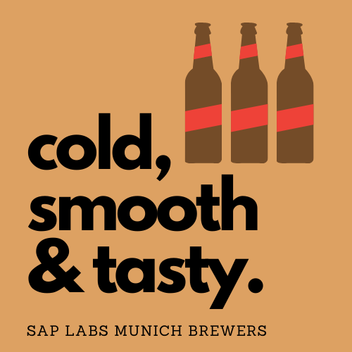

# SAP Labs Munich Brewers

## TODO
- sap labs munich beer shot & upload Github

The SAP Labs Munich Brewers are passionate about beer. What makes us special is that we don't just drink it, we define and optimize it over time. Together with Our partners [Hopcode](https://www.hopcode.bayern/en/) and [Rhaner Braeu](https://www.rhaner.de/), we released our first very own beer recipe, the 2022 edition. 

While the large quantities of beer for our parties and events are being brewed directly at Rhaner Braeu, we release a DIY 20l version of this recipe for all the home brewers via this GitHub repo. Feel free to use our recipe, brew the 2022 Edition and then make some changes and experiment with the hops used. We would love to see what variations you come up with!

 

The recipes are open source and we use the [Punk API](https://punkapi.com/documentation/v2) standard to describe the brewing process. For better readability, we also created a PDF version with all the details. If you brew the beer at home and make changes to the recipe, we would love to see the changed definition file. 